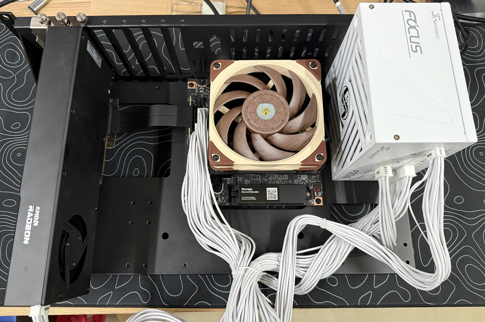

I've had a Strix Halo board for about a year and been playing around with it for various projects when it's not just being a beefy linux machine. I ordered the 128GB Framework Desktop board pre-panic and I'm very grateful for that. I also grabbed an R9700 Pro AI card late last year for another machine, thinking it would be fun to compare the two. I ended up parting out the machine the R9700 was in for something else and wondered what might be possible with the R9700 in the Strix Halo machine.  On the Framework desktop board, there's an x4 4.0 slot hanging out. I already had an x4 extension cable so I could mount a 25G card in it, but a GPU would fit just fine too. I have my board in a Fractal Design case instead of the framework shell (bought the bare board), so I had plenty of room for the card and my power supply had the new 12V connector. Even with today's pricing, a Framework Strix Halo 128GB board and an R9700 is about ~5k all in, so similar price to a DGX spark but with a little more RAM (~160GB, obv with caveats), and it's a regular 16-core ryzen PC instead of the tacky gold box. 



So, the kicker is that it works. 49 tok/s, 682 tok/s prefill at 32K - double the stock 24 tok/s and 2.5x prefill on Qwen-3.5-122b. 

Getting this working was a little bit of a mind-bender, so wanted to share with people. Here's how it works. We can't just slap part of the model on the R9700 and expect it to be good though. It's actually worse if you try to do that in most cases. First, we need to place the parts of the model that benefit from the different parts of the hardware. So, with a big MoE model like this, we have a bunch of data that only gets touched for some tokens and those routed experts need to get put on the Strix in the bigger unified memory pool. It works out to about 62GB of the 71GB model, but we might only read 2GB of it per token. The dense parts of the model are about ~4GB and since they get touched for every token, we can put that on the R9700 where we have more compute and memory bandwidth. So we put KV cache, the dense part of the model, and critically, the MTP drafter on the R9700. We can stuff the remaining VRAM on the R9700 with as many layers as fix, which in my setup was 14. This all works because only about 12KB of data per token needs to cross that narrow x4 4.0 link, so as long as the latency isn't bad, it doesn't matter. Trying to do something like Tensor Parallelism across these two would not work well because of that bottleneck. 

Here's part of the config:

llama-server -m Qwen3.5-122B-A10B-Opus-Reasoning-Q4_K_XL.gguf \
  -dev ROCm0,ROCm1 -ts 1,0 --fit off -ngl 999 -fa on --jinja --no-mmap \
  -ot 'blk\.(1[4-9]|[2-4][0-9])\.ffn_(gate|up|down)_exps=ROCm1' \
  -c 32768 -ub 4096 -b 4096 \
  -md mtp-draft-out-q4_K.gguf --spec-type draft-mtp -devd ROCm0 \
  --spec-draft-n-max 4 --spec-draft-p-min 0.5

I kept going on tuning, and tried to reduce the number of kernel launches, which seemed to be holding back performance. I wasn't hitting anywhere near the right numbers per the theoretical bandwidth for each device. I made some updates to llama to make this work, linked on github below. The variant of the model I was using is also linked below, which is a fine tune that I requantized and grafted on an MTP head for my use on a different project.

https://huggingface.co/SixVolts/Qwen3.5-122B-A10B-Opus-Reasoning-MTP-GGUF

## Qwen3.8-Flash-Next on the same box

The model that replaced the 122B for me: 512 experts per layer, 36 layers of gated DeltaNet, 12 layers of
top-k sparse attention, a 28.8 GB n-gram table, and (since 1 Sep) an MTP draft head shipped separately.
Same idea as above: dense trunk, KV cache and the draft head on the R9700, the routed experts of most layers on
the Strix, the n-gram table in host RAM. This repo's `main` is upstream master plus the MTP work from
unslothai/llama.cpp#144 and ggml-org#28118, plus the kernel and scheduler changes described in
[HALO-HYBRID.md](HALO-HYBRID.md). Stock llama.cpp on this layout decodes at 27–28 tok/s; this branch does
~45 with the model-card sampler and ~52 greedy, from 22 on the Strix alone.

Launch (single user, 8K context; ROCm0 is the R9700, ROCm1 the iGPU — check the device order in the startup log):

```
sudo sh -c 'echo 2 > /proc/sys/vm/drop_caches'   # drain the iGPU's TTM pool before a big load

llama-server -m Qwen3.8-Flash-Next-UD-Q4_K_XL-00001-of-00004.gguf \
  -dev ROCm0,ROCm1 -ts 1,0 --fit off -fa on -ngl 999 -c 8192 --no-mmap -np 1 \
  -ot 'blk\.(1[4-9]|[2-4][0-9])\.ffn_(gate|up|down)_exps=ROCm1,per_layer_token_embd=CPU' \
  -md mtp-Qwen3.8-Flash-Next-shared-Q8_0.gguf -devd ROCm0 -ngld 999 \
  --spec-type draft-mtp --spec-draft-n-max 2 \
  --host 0.0.0.0 --port 8080
```

* Model: `unsloth/Qwen3.8-Flash-Next-GGUF` UD-Q4_K_XL (four shards, 111 GB). Draft head: the `shared-Q8_0` file in
  that repo's `MTP/` folder (2.6 GB). It borrows the target's embeddings and lm head, so `-devd ROCm0` is required.
* `-ot` moves the routed experts of layers 14–47 to the iGPU ("hybrid-14") and keeps the n-gram table in host RAM.
  Hybrid-14 is the most the R9700 holds next to the draft head at 8K context. For 16K use `blk\.(1[2-9]|[2-4][0-9])`
  (hybrid-12), for 64K+ use `blk\.(1[0-9]|[2-4][0-9])` (hybrid-10); past 64K the sparse-attention gather turns on by itself.
* Use `/v1/chat/completions`. A bare prompt on `/completion` stops after one token with this model.
  `"chat_template_kwargs": {"enable_thinking": false}` turns thinking off per request.
* `--spec-draft-n-max 2`; 3 is the same within noise, 4 is worse, and `--spec-draft-p-min` raises acceptance but
  not speed. Acceptance is ~0.70 greedy and ~0.51 with the model-card sampler (temperature 1.0, top-p 0.95, top-k 20),
  which is the whole difference between 52 and 45 tok/s.
* 128 GB is the working minimum: ~51 GB of experts on the iGPU, the 28.8 GB table plus page cache in host RAM,
  26 GB + the head on the R9700. Drain caches before launching after big file activity.
* The draft head only pays for one or two streams. For multi-user serving leave the `-md`/`--spec-type` lines out.

Measured on this build (model-card sampler, 4K prompts, 256-token completions; `-b 4096 -ub 1024`; "agg" is the
sum over streams, single-stream rows are the per-stream number):

| streams | layout | prefill, agg tok/s | decode, no draft | decode, MTP n-max 2 |
|---|---|---|---|---|
| 1 | hybrid-12 | 610 (16K prompt: 623) | 34.3 | **45.4** (greedy ~52) |
| 2 | hybrid-12 | 627 | 49.0 agg, 26.0 each | 53.0 agg, 29.8 each |
| 4 | hybrid-12 | 642 | 66.3 agg, 17.9 each | does not fit with the head |
| 4 | hybrid-10 | 585 | 47.8 agg, 12.7 each | 51.5 agg, 14.0 each |
| 1 at 68K context | hybrid-12 / hybrid-10 | 413 (`-ub 1024`) / 306 (`-ub 512`) | 25.7 | **43.6** |

The 4-stream rows move by up to 30% between sessions on this box (the 122B behaved the same), so read them as
"the head is roughly break-even at four streams", not as a ranking of hybrid-12 against hybrid-10. The 68K rows use
the sparse-attention gather ported from ucicelos/flashnext-hybrid; both needles in a 2,300-record haystack are retrieved
with it on and off, and the answer text is identical.


# llama.cpp


<div align="center">

<b>LLM inference in C/C++</b>

[](https://opensource.org/licenses/MIT)
[](https://github.com/ggml-org/llama.cpp/releases?q=tag:v0)
[](https://github.com/ggml-org/llama.cpp/releases?q=b)
[](https://github.com/ggml-org/llama.cpp/actions/workflows/server.yml)
[](https://github.com/ggml-org/llama.cpp/actions/workflows/docker.yml)
[](https://github.com/ggml-org/llama.cpp/actions/workflows/winget.yml)

[ggml](https://github.com/ggml-org/ggml) / [ops](https://github.com/ggml-org/llama.cpp/blob/master/docs/ops.md) / [maintainer PRs](https://github.com/ggml-org/llama.cpp/issues?q=is%3Apr%20is%3Aopen%20draft%3AFalse%20(author%3Argerganov%20OR%20author%3AKitaitiMakoto%20OR%20author%3Adanbev%20OR%20author%3Aaldehir%20OR%20author%3Amax-krasnyansky%20OR%20author%3ACISC%20OR%20author%3Aggerganov%20OR%20author%3Aam17an%20OR%20author%3Abartowski1182%20OR%20author%3Anikwen%20OR%20author%3Ahipudding%20OR%20author%3AServeurpersoCom%20OR%20author%3Apwilkin%20OR%20author%3Areeselevine%20OR%20author%3Angxson%20OR%20author%3Ajeffbolznv%20OR%20author%3Amarty1885%20OR%20author%3A0cc4m%20OR%20author%3ATitaniumtown%20OR%20author%3Aangt%20OR%20author%3AIMbackK%20OR%20author%3Aarthw%20OR%20author%3AJohannesGaessler%20OR%20author%3AORippler%20OR%20author%3Aruixiang63%20OR%20author%3Axctan%20OR%20author%3Aallozaur%20OR%20author%3Ayomaytk%20OR%20author%3Aaendk%20OR%20author%3Agaugarg-nv%20OR%20author%3Ataronaeo%20OR%20author%3Aforforever73%20OR%20author%3Alhez%20OR%20author%3Anetrunnereve%20OR%20author%3Afairydreaming)%20sort%3Aupdated-desc) / [dev stats](https://github.com/ggml-org/llama.cpp-dev) / [lib llama API](https://github.com/ggml-org/llama.cpp/issues/9289) / [llama-server REST API](https://github.com/ggml-org/llama.cpp/issues/9291)

</div>

## Quick start

A few options to get `llama.cpp` installed on your machine:

- Visit https://llama.app and follow the instructions
- Run with Docker - see our [Docker documentation](docs/docker.md)
- Download pre-built binaries from the [releases page](https://github.com/ggml-org/llama.cpp/releases)
- Build from source by cloning this repository - check out [our build guide](docs/build.md)

Once installed:

```sh
# Download and run a model directly from Hugging Face
llama cli -hf ggml-org/Qwen3.5-0.8B-GGUF

# Launch OpenAI-compatible API server
llama serve -hf ggml-org/Qwen3.5-0.8B-GGUF
```

<table align="center">
    <tr>
        <td align="center" width=50%>
            
            <i>VLM session with <b>llama cli</b></i>
        </td>
        <td align="center">
            
            <i>Built-in web UI against <b>llama serve</b></i>
        </td>
    </tr>
<table>

## Description

The main goal of `llama.cpp` is to enable LLM (and VLM) inference with minimal setup and state-of-the-art performance on
a wide range of hardware - locally and in the cloud.

- Plain C/C++ implementation without any dependencies
- Apple silicon is a first-class citizen - optimized via ARM NEON, Accelerate and Metal frameworks
- AVX, AVX2, AVX512 and AMX support for x86 architectures
- RVV, ZVFH, ZFH, ZICBOP and ZIHINTPAUSE support for RISC-V architectures
- 1.5-bit, 2-bit, 3-bit, 4-bit, 5-bit, 6-bit, and 8-bit integer quantization for faster inference and reduced memory use
- Custom CUDA kernels for running LLMs on NVIDIA GPUs (support for AMD GPUs via HIP and Moore Threads GPUs via MUSA)
- Vulkan and SYCL backend support
- CPU+GPU hybrid inference to partially accelerate models larger than the total VRAM capacity

The `llama.cpp` project is build on top of the [ggml](https://github.com/ggml-org/ggml) library.

## Supported backends

| Backend | Target devices |
| --- | --- |
| [BLAS](docs/build.md#blas-build) | All |
| [BLIS](docs/backend/BLIS.md) | All |
| [CANN](docs/build.md#cann) | Ascend NPU |
| [CUDA](docs/build.md#cuda) | Nvidia GPU |
| [HIP](docs/build.md#hip) | AMD GPU |
| [Hexagon [In Progress]](docs/backend/snapdragon/README.md) | Snapdragon |
| [IBM zDNN](docs/backend/zDNN.md) | IBM Z & LinuxONE |
| [MUSA](docs/build.md#musa) | Moore Threads GPU |
| [Metal](docs/build.md#metal-build) | Apple Silicon |
| [OpenCL](docs/backend/OPENCL.md) | Adreno GPU |
| [OpenVINO [In Progress]](docs/backend/OPENVINO.md) | Intel CPUs, GPUs, and NPUs |
| [RPC](https://github.com/ggml-org/llama.cpp/tree/master/tools/rpc) | All |
| [SYCL](docs/backend/SYCL.md) | Intel GPU |
| [VirtGPU](docs/backend/VirtGPU.md) | VirtGPU APIR |
| [Vulkan](docs/build.md#vulkan) | GPU |
| [WebGPU](docs/build.md#webgpu) | All |
| [ZenDNN](docs/build.md#zendnn) | AMD CPU |

## Documentation

#### Tools

- [cli](tools/cli/README.md)
- [completion](tools/completion/README.md)
- [server](tools/server/README.md)
- [GBNF grammars](grammars/README.md)

#### Development

- [How to build](docs/build.md)
- [Running on Docker](docs/docker.md)
- [Build on Android](docs/android.md)
- [Multi-GPU usage](docs/multi-gpu.md)
- [Performance troubleshooting](docs/development/token_generation_performance_tips.md)
- [GGML tips & tricks](https://github.com/ggml-org/llama.cpp/wiki/GGML-Tips-&-Tricks)
- [XCFramework](docs/xcframework.md)
- [Completions](docs/completions.md)
- [Models](docs/models.md)
- [Release process](docs/release.md)

## Contributing

- Contributors can open PRs
- Collaborators will be invited based on contributions
- Maintainers can push to branches in the `llama.cpp` repo and merge PRs into the `master` branch
- Any help with managing issues, PRs and projects is very appreciated!
- Read the [CONTRIBUTING.md](CONTRIBUTING.md) for more information

## Acknowledgements

- [yhirose/cpp-httplib](https://github.com/yhirose/cpp-httplib) - Single-header HTTP server, used by `llama-server` - MIT license
- [nothings/stb](https://github.com/nothings/stb) - Single-header image format decoder, used by multimodal subsystem - Public domain
- [nlohmann/json](https://github.com/nlohmann/json) - Single-header JSON library, used by various tools/examples - MIT License
- [mackron/miniaudio](https://github.com/mackron/miniaudio) - Single-header audio format decoder, used by multimodal subsystem - Public domain
- [sheredom/subprocess.h](https://github.com/sheredom/subprocess.h) - Single-header process launching solution for C and C++ - Public domain
