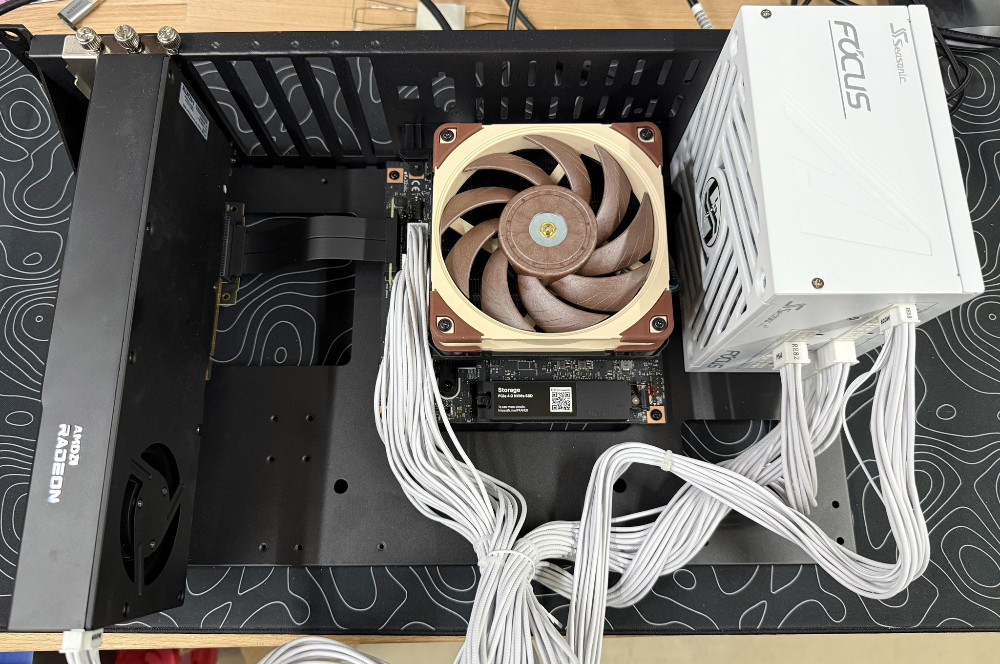

# llama-halo-hybrid - Strix Halo + Radeon R9700

This is a fork of llama.cpp that builds out support for Strix Halo with a GPU sidecar, initially targeting the R9700/Navi48. The idea is that you can take an R9700, or similar, and place dense parts of the model, KV, and some of the layers on the GPU and let the APU take the rest of the model. You can add the extra GPU through a PCIe extender (framework desktop), Occulink, or a thunderbolt dock depending on which machine you have. This is not some custom inference engine that requires a custom quant to run. This is llama.cpp modified to run whatever you want, albeit mostly tuned for Qwen and GLM families. 

Upfront/Note - if you are just using Strix Halo by itself, this is probably not the right tool. Check out Gufo (https://github.com/gufo-org/gufo), which looks very promising.
After continuing to tinker with it, it now performs better than DGX Spark running Qwen-3.8-flash-next and slightly better yet with the Swift-1.5 variant.



 The model this tree is built around is **Qwen3.8-Flash-Next** (unsloth
UD-Q4_K_XL, 111 GB, and the Swift 1.5 fine-tune of it): on the Strix Halo plus the R9700 it decodes at **60+ tok/s**
(real content, T=0.7) with the model's own MTP draft head and prefills at **~2,300 tok/s** at 16K, where stock
llama.cpp on the same layout does 27-28 tok/s. On the Strix Halo alone it does ~40 tok/s and ~890 tok/s. The same
tree also runs the 200 GB GLM-5.3-Flash across two of these boxes over a 100G link at 30 tok/s. (The setup was put
together on Qwen3.5-122B, 24 → 49 tok/s; 3.8 came out the week it was working, and the numbers below are 3.8's.)

Here's how it works. We can't just slap part of the model on the R9700 and expect it to be good though. It's
actually worse if you try to do that in most cases. First, we need to place the parts of the model that benefit
from the different parts of the hardware. So, with a big MoE model like this, we have a bunch of data that only
gets touched for some tokens and those routed experts need to get put on the Strix in the bigger unified memory
pool. Most of the model is experts, but we might only read a couple of GB of it per token. The dense parts of the
model get touched for every token, so we put them on the R9700 where we have more compute and memory bandwidth:
KV cache, the dense trunk, and critically, the MTP drafter. We can stuff the remaining VRAM on the R9700 with as
many whole expert layers as fit. This all works because only a few KB of data per token needs to cross that narrow
x4 4.0 link, so as long as the latency isn't bad, it doesn't matter. Trying to do something like Tensor Parallelism
across these two would not work well because of that bottleneck.

## What this fork is for

There are good engines for a single Strix Halo already (gufo, halogen), and they are fast at what they do. This
tree is about the setups they don't cover, without giving up the one they do:

- **One box, APU + a discrete GPU.** The card has to earn its slot: with the R9700 the box must beat the best
  APU-only engine, not just this tree's own APU-only numbers. It does, by about 1.6x on prefill and 1.8x on decode.
- **Several boxes.** Models bigger than one box's memory (GLM-5.3-Flash, 200 GB) split across hosts over RPC,
  with and without cards.

## Where it stands (2026-09-28)

The 2026-09-30 numbers on the Spark's benchmark are in [Against a DGX Spark](#against-a-dgx-spark-2026-09-30) below.

Measured on this box (Framework Strix Halo 128 GB + R9700 on PCIe 4.0 x4). Prefill is cold, fresh server, record
prompts; decode is real-content chat at T=0.7 with the MTP draft (6 prompts x 2 seeds short, 3 prompts x 2 seeds at
~20K context).

| Config | Model | Prefill 4K / 16K / 32K (tok/s) | Decode, short | Decode, ~20K context |
|---|---|---|---|---|
| Strix Halo + R9700 | Qwen3.8-Flash-Next UD-Q4_K_XL | 2078 / 2300 / 2141 | 63 tok/s (35.4 ms/step) | 62 tok/s (40.0 ms/step) |
| Strix Halo + R9700 | Swift 1.5 (q8_0 trunk) | 2052 / 2285 / 2129 | 62 tok/s (35.9 ms/step) | 60 tok/s (40.4 ms/step) |
| Strix Halo only | Qwen3.8-Flash-Next UD-Q4_K_XL | 954 / 892 / 821 | 40 tok/s (56 ms/step) | 39 tok/s (62.8 ms/step) |
| Strix Halo only | Swift 1.5 (q8_0 trunk) | 964 / 893 / 823 | 39 tok/s (56.7 ms/step) | 39 tok/s (63.7 ms/step) |
| 2x (Strix Halo + R9700) | GLM-5.3-Flash UD-Q4_K_XL | 783 at 12.7K, 896 at 25.8K | - | 30 tok/s at 25.8K (92 ms/step) |

For reference, on the same box: gufo (APU-only) 1359 / 1431 / 1410 prefill and 34.8 tok/s MTP decode; halogen
(APU-only, its own 4-bit format) 1246 at 8K / 1424 at 32K prefill and 44.8 tok/s MTP decode on prose.

What that means:

- **With the card**, prefill is 1.5-1.6x the best APU-only engine and decode ~1.8x, and long context barely costs
  anything (63 -> 62 tok/s at 20K).
- **APU only**, decode is ahead of gufo and behind halogen; prefill is still 30-42% behind gufo, and the gap grows
  with context. What's left there is the hyper-connection memory traffic and the sparse-attention kernel itself.
- **Swift 1.5 with a q8_0 trunk** runs at the base model's speed within a few percent (and at ~3% lower perplexity
  than the fine-tune's published Q4_K_M).

The launch line for the Strix Halo + R9700 layout:

```
LLAMA_PREFILL_LANES=2 \
llama-server -m Qwen3.8-Flash-Next-UD-Q4_K_XL-00001-of-00004.gguf \
  -dev ROCm0,ROCm1 -ts 1,0 --fit off -fa on -ngl 999 -c 40960 -b 5120 -ub 2560 -np 1 \
  -ot 'blk\.(1[1-9]|[2-4][0-9])\.ffn_(gate|up|down)_exps=ROCm1' \
  -md mtp-Qwen3.8-Flash-Next-shared-exps-q4k-head-q4_K.gguf -devd ROCm0 -ngld 999 \
  --spec-type draft-mtp --spec-draft-n-max 2 \
  --host 0.0.0.0 --port 8080
```

On the Strix Halo alone: `-dev ROCm0` (the iGPU when it's the only device), no `-ot`, `-b 4096 -ub 4096`, and the
same draft on the iGPU. The draft head gets its own q4_K output layer (commands in the cookbook, recipe 6).

Where the model lives: the weights sit in the R9700's VRAM (dense trunk, KV cache, experts of the first 11 layers,
the draft head) and in the APU's GTT (the rest of the experts, ~51 GB). The 26.8 GB n-gram / per-layer-embedding
table stays on the CPU side and is read through the page cache (lazy mode, the default): it is mapped, only the ~16
rows a token needs are read, and once touched those pages stay in host RAM, so nothing streams from disk in steady
state. Don't force a resident copy with `-ot per_layer_token_embd=CPU` / `-lzm off` - that adds a 26.8 GB anonymous
allocation for no speed, and on the Strix Halo alone it is the difference between ~39 GB and ~12 GB of free memory.

### Against a DGX Spark (2026-09-30)

The target: one Strix Halo + one R9700 should beat one NVIDIA DGX Spark (GB10, 128 GB, 273 GB/s) on the same model.
The reference is the fastest single-Spark result for Qwen3.8-Flash-Next that we know of
([tonyd2wild/Qwen3.8-Flash-Next-NVFP4-DGX-Spark](https://github.com/tonyd2wild/Qwen3.8-Flash-Next-NVFP4-DGX-Spark)
at commit 6ad1c8f, 2026-09-06: vLLM with NVIDIA's NVFP4 checkpoint, an MTP3 draft, 262K context). The Spark column
below is copied from that repo's README and result files, not measured by us. We ran **its own scripts** on our box:
`bench_categories.py` (40 prompts, 8 categories, T=0, thinking off) and `stress_prefill.py` (needle in a
repeated filler, cold).

Two changes to the scripts:
- **Prefix caching off (`cache_prompt: false`).** It matches the Spark's no-prefix-cache runs.
- **Thinking off in the prefill script.** Otherwise the model spends its 16-token answer budget thinking.

Token counts are matched: llama.cpp tokenizes the filler to 0.88x of vLLM's counts, so we ran it longer to hit the
Spark's 7,060 / 28,255 / 112,738 tokens.

Model: Qwen3.8-Flash-Next UD-Q4_K_XL (~4.8 bits per weight, against NVFP4's ~4.5), with the q4_K-head MTP draft.
Two numbers in a cell mean two runs; every other cell is a single run. The same preset's decode median varies by
about ±3 tok/s between sessions (65.5 to 69.6 over four sessions on the prefill preset). The concurrency-preset
prefill was measured before the fused head-sum op.

| | DGX Spark | Strix Halo + R9700, 128K (prefill preset) | Strix Halo + R9700, 128K (concurrency preset) | Strix Halo + R9700, 262K | Strix Halo alone, 128K |
|---|---|---|---|---|---|
| Decode median, 1 stream (tok/s) | 43.9 | 65.5 / 67.3 | 70.6 | 67.8 | 47.4 |
| Prose (tok/s) | 29.0 | 55.0 / 55.0 | 59.8 | 57.1 | 40.7 |
| Prefill 7K (tok/s) | 1,269 | 2,265 / 2,322 | 2,120 | 2,081 | 937 |
| Prefill 28K | 1,757 | 2,195 / 2,190 | 2,133 | 2,108 | 841 |
| Prefill 113K | 1,760 | 1,707 / 1,790 | 1,694 | 1,671 | 677 |
| Per stream at 2 / 4 / 6 streams | 33.4 / 26.4 / 21.7 | 41.8 / 31.1 / 20.2 | 48.1 / 32.2 / 21.5 | - | 27.5 / 15.9 / 14.4 |
| Quality auto-score | 0.88 | 0.85 | 0.82 | 0.82 | 0.88 |

Presets:
- **128K prefill preset:** all experts on the APU, `-ub 4096 -b 8192`.
- **128K concurrency preset:** experts 5-47 on the APU, `-ub 2560 -b 5120`.
- **262K:** experts 5-47 on the APU, `-ub 2560`, with `LLAMA_QSA_CHUNK_MB=256 LLAMA_SPEC_DRAFT_UB=512` (next section).

The table is at `--spec-draft-n-max 2`. With `--spec-draft-n-max 3` on the prefill preset (sampled MTP requests are
still capped at 2 drafts, `LLAMA_SPEC_NMAX_SAMPLED`), the per-prompt median on this bench rises from ~69.5 to ~74.9
tok/s (ABBA in one session). Short answers dominate that median; the token-weighted throughput barely moves (65.0 ->
65.8).

Swift 1.5 on the 128K prefill preset measured 2,382 / 2,178 / 1,752 prefill and 67.1 tok/s decode.

What that means:
- **Decode:** the card wins clearly, 1.5x the Spark single-stream and 2x on prose. Even the Strix Halo alone is ahead.
- **Prefill:** 1.7-1.8x at 7K and ~1.25x at 28K. At 113K it's a tie, between 1,707 and 1,790 across runs.
- **Several streams:** we win at 2 and 4 streams. At 6 streams the concurrency preset ties (21.5 against 21.7) and
  the prefill preset is 7% behind (20.2). Every extra token in a decode step touches ~1 GB of
  new experts, which is a memory-bandwidth wall the Spark shares.
- **Where the time goes at long context:** the card's sparse attention (a 16-query tile walks ~12K cells, 6x what
  one query needs) and the indexer's top-k. Those are the levers left.
- **Quality:** the auto-score misses are word-count limits in both setups. The quants differ, so compare the
  quality columns as indicative only.

### Long context: 256K on the Strix Halo + R9700

The model's full 256K window fits on the hybrid layout. The KV cache is small (~27 KiB per token, ~7 GB at 256K:
only 12 of the 48 layers are attention). What grows is the prefill scratch on the card, which scales with context x
ubatch. Since 2026-09-30 the QSA indexer builds that scratch in chunks.

At 256K, run the fast layout with a 256 MB chunk budget and a smaller draft ubatch:

```
LLAMA_PREFILL_LANES=2 LLAMA_QSA_CHUNK_MB=256 LLAMA_SPEC_DRAFT_UB=512 \
llama-server -m Qwen3.8-Flash-Next-UD-Q4_K_XL-00001-of-00004.gguf \
  -dev ROCm0,ROCm1 -ts 1,0 --fit off -fa on -ngl 999 -c 262144 -b 5120 -ub 2560 -np 1 \
  -ot 'blk\.([5-9]|[1-4][0-9])\.ffn_(gate|up|down)_exps=ROCm1' \
  -md mtp-Qwen3.8-Flash-Next-shared-exps-q4k-head-q4_K.gguf -devd ROCm0 -ngld 999 \
  --spec-type draft-mtp --spec-draft-n-max 2
```

On the Spark needle prompts at 7K / 28K / 113K it measures 2,081 / 2,108 / 1,671 tok/s, with 67.8 tok/s decode.
The chunking applies to a single sequence's cache. Several slots don't need it: with `-np N` each slot's cache is
n_ctx/N. For example, `-np 2 -c 262144` starts unchunked (4.4 GB compute buffer) and measured 2,140 / 1,745 tok/s at
7K / 113K. The
earlier 256K recipe (`-ub 1024`) read 1,386 tok/s at 77K, 1,161 at 155K and 979 at 251K. Those numbers are from before
the chunking and top-k changes, and they're kept here for the record.

I kept going on tuning, and tried to reduce the number of kernel launches, which seemed to be holding back
performance. I wasn't hitting anywhere near the right numbers per the theoretical bandwidth for each device. The
kernel and scheduler changes that came out of that are listed in [HALO-HYBRID.md](HALO-HYBRID.md), and the running
log of the latest rounds, with every number and what didn't work, is in
[APU-DECODE-BUDGET.md](docs/halo-hybrid/APU-DECODE-BUDGET.md).

## Which configuration?

The same tree runs five hardware shapes. Each row links to the launch line, the memory budget and the numbers in
the [cookbook](docs/halo-hybrid/COOKBOOK.md); the kernel and scheduler changes behind them are in
[HALO-HYBRID.md](HALO-HYBRID.md).

| Hardware | Model it runs here | Status | Numbers |
|---|---|---|---|
| [One Strix Halo, nothing else](docs/halo-hybrid/COOKBOOK.md#1-one-strix-halo-by-itself) | anything up to ~115 GB | runs | Qwen3.8-Flash-Next 40 tok/s, ~890 tok/s prefill at 16K |
| [One Strix Halo + one R9700](docs/halo-hybrid/COOKBOOK.md#2-one-strix-halo--one-r9700) | Qwen3.8-Flash-Next, Swift 1.5, Qwen3.5-122B, GLM-5.3-Flash (UD-Q2_K_XL) | production | 63 tok/s, ~2,300 tok/s prefill at 16K (Qwen3.8); GLM-5.3-Flash Q2: 44 tok/s, ~620 tok/s prefill, 128K context ([recipe](docs/halo-hybrid/COOKBOOK.md#glm-53-flash-at-ud-q2_k_xl-one-box-2026-10-01)) |
| [Two Strix Halos over the 100G link](docs/halo-hybrid/COOKBOOK.md#3-two-strix-halos-over-rdma) | GLM-5.3-Flash (200 GB) | derived, not measured | |
| [Two Strix Halos + one R9700 on the head node](docs/halo-hybrid/COOKBOOK.md#4-two-strix-halos--one-r9700-on-the-head-node) | GLM-5.3-Flash | superseded by the next row | 517 tok/s prefill / 20.5 tok/s decode at 13K (09-08) |
| [Two Strix Halos + one R9700 on each](docs/halo-hybrid/COOKBOOK.md#5-two-strix-halos--one-r9700-on-each) | GLM-5.3-Flash | production | 896 tok/s prefill / 30 tok/s decode at 25.8K |

## GLM-5.3-Flash across two Strix Halo boxes

The 200 GB GLM-5.3-Flash (unsloth UD-Q4_K_XL) runs split between two 128 GB Strix Halo boxes over a direct 100G
link (Intel E810) with llama.cpp's RPC backend, with an R9700 on each box: on the head node KV, the dense trunk of
the first 26 layers and the MTP draft head on the card, their experts on the iGPU; the second box schedules its own
half across its card and iGPU. Single stream, 128K context: 30 tok/s decode and 896 tok/s prefill at a 25.8K prompt,
with the model's own MTP head. The link currently runs over TCP (RDMA is off after
E810 resets under load). Launch lines, the rpc-server unit and the operating rules:
[cookbook, recipe 5](docs/halo-hybrid/COOKBOOK.md#5-two-strix-halos--one-r9700-on-each); the draft-head
export and the fixes: [HALO-HYBRID.md](HALO-HYBRID.md) ("GLM-5.3-Flash across two hosts").

---

# llama.cpp


<div align="center">

<b>LLM inference in C/C++</b>

[](https://opensource.org/licenses/MIT)
[](https://github.com/ggml-org/llama.cpp/releases?q=tag:v0)
[](https://github.com/ggml-org/llama.cpp/releases?q=b)
[](https://github.com/ggml-org/llama.cpp/actions/workflows/server.yml)
[](https://github.com/ggml-org/llama.cpp/actions/workflows/docker.yml)
[](https://github.com/ggml-org/llama.cpp/actions/workflows/winget.yml)

[ggml](https://github.com/ggml-org/ggml) / [ops](https://github.com/ggml-org/llama.cpp/blob/master/docs/ops.md) / [maintainer PRs](https://github.com/ggml-org/llama.cpp/issues?q=is%3Apr%20is%3Aopen%20draft%3AFalse%20(author%3Argerganov%20OR%20author%3AKitaitiMakoto%20OR%20author%3Adanbev%20OR%20author%3Aaldehir%20OR%20author%3Amax-krasnyansky%20OR%20author%3ACISC%20OR%20author%3Aggerganov%20OR%20author%3Aam17an%20OR%20author%3Ajhen0409%20OR%20author%3Abartowski1182%20OR%20author%3Anikwen%20OR%20author%3Ahipudding%20OR%20author%3Aravi9%20OR%20author%3AServeurpersoCom%20OR%20author%3Apwilkin%20OR%20author%3Areeselevine%20OR%20author%3Angxson%20OR%20author%3Ajeffbolznv%20OR%20author%3Amarty1885%20OR%20author%3A0cc4m%20OR%20author%3ATitaniumtown%20OR%20author%3Aangt%20OR%20author%3AIMbackK%20OR%20author%3Aarthw%20OR%20author%3AJohannesGaessler%20OR%20author%3AORippler%20OR%20author%3Aruixiang63%20OR%20author%3Axctan%20OR%20author%3Aallozaur%20OR%20author%3Ayomaytk%20OR%20author%3Aaendk%20OR%20author%3Awine99%20OR%20author%3Agaugarg-nv%20OR%20author%3Ataronaeo%20OR%20author%3Aforforever73%20OR%20author%3Alhez%20OR%20author%3Anetrunnereve%20OR%20author%3Afairydreaming)%20sort%3Aupdated-desc) / [dev stats](https://github.com/ggml-org/llama.cpp-dev) / [lib llama API](https://github.com/ggml-org/llama.cpp/issues/9289) / [llama-server REST API](https://github.com/ggml-org/llama.cpp/issues/9291)

</div>

## Quick start

A few options to get `llama.cpp` installed on your machine:

- Visit https://llama.app and follow the instructions
- Run with Docker - see our [Docker documentation](docs/docker.md)
- Download pre-built binaries from the [releases page](https://github.com/ggml-org/llama.cpp/releases)
- Build from source by cloning this repository - check out [our build guide](docs/build.md)

Once installed:

```sh
# Download and run a model directly from Hugging Face
llama cli -hf ggml-org/Qwen3.5-0.8B-GGUF

# Launch OpenAI-compatible API server
llama serve -hf ggml-org/Qwen3.5-0.8B-GGUF
```

<table align="center">
    <tr>
        <td align="center" width=50%>
            
            <i>VLM session with <b>llama cli</b></i>
        </td>
        <td align="center">
            
            <i>Built-in web UI against <b>llama serve</b></i>
        </td>
    </tr>
<table>

## Description

The main goal of `llama.cpp` is to enable LLM (and VLM) inference with minimal setup and state-of-the-art performance on
a wide range of hardware - locally and in the cloud.

- Plain C/C++ implementation without any dependencies
- Apple silicon is a first-class citizen - optimized via ARM NEON, Accelerate and Metal frameworks
- AVX, AVX2, AVX512 and AMX support for x86 architectures
- RVV, ZVFH, ZFH, ZICBOP and ZIHINTPAUSE support for RISC-V architectures
- 1.5-bit, 2-bit, 3-bit, 4-bit, 5-bit, 6-bit, and 8-bit integer quantization for faster inference and reduced memory use
- Custom CUDA kernels for running LLMs on NVIDIA GPUs (support for AMD GPUs via HIP and Moore Threads GPUs via MUSA)
- Vulkan and SYCL backend support
- CPU+GPU hybrid inference to partially accelerate models larger than the total VRAM capacity

The `llama.cpp` project is build on top of the [ggml](https://github.com/ggml-org/ggml) library.

## Supported backends

| Backend | Target devices |
| --- | --- |
| [BLAS](docs/build.md#blas-build) | All |
| [BLIS](docs/backend/BLIS.md) | All |
| [CANN](docs/build.md#cann) | Ascend NPU |
| [CUDA](docs/build.md#cuda) | Nvidia GPU |
| [HIP](docs/build.md#hip) | AMD GPU |
| [Hexagon](docs/backend/snapdragon/README.md) | Snapdragon |
| [IBM zDNN](docs/backend/zDNN.md) | IBM Z & LinuxONE |
| [MUSA](docs/build.md#musa) | Moore Threads GPU |
| [Metal](docs/build.md#metal-build) | Apple Silicon |
| [OpenCL](docs/backend/OPENCL.md) | Adreno GPU |
| [OpenVINO [In Progress]](docs/backend/OPENVINO.md) | Intel CPUs, GPUs, and NPUs |
| [RPC](https://github.com/ggml-org/llama.cpp/tree/master/tools/rpc) | All |
| [SYCL](docs/backend/SYCL.md) | Intel GPU |
| [VirtGPU](docs/backend/VirtGPU.md) | VirtGPU APIR |
| [Vulkan](docs/build.md#vulkan) | GPU |
| [WebGPU](docs/build.md#webgpu) | All |
| [ZenDNN](docs/build.md#zendnn) | AMD CPU |

## Documentation

#### Tools

- [cli](tools/cli/README.md)
- [completion](tools/completion/README.md)
- [server](tools/server/README.md)
- [GBNF grammars](grammars/README.md)

#### Development

- [How to build](docs/build.md)
- [Running on Docker](docs/docker.md)
- [Build on Android](docs/android.md)
- [Multi-GPU usage](docs/multi-gpu.md)
- [Performance troubleshooting](docs/development/token_generation_performance_tips.md)
- [GGML tips & tricks](https://github.com/ggml-org/llama.cpp/wiki/GGML-Tips-&-Tricks)
- [XCFramework](docs/xcframework.md)
- [Completions](docs/completions.md)
- [Models](docs/models.md)
- [Release process](docs/release.md)

## Contributing

- Contributors can open PRs
- Collaborators will be invited based on contributions
- Maintainers can push to branches in the `llama.cpp` repo and merge PRs into the `master` branch
- Any help with managing issues, PRs and projects is very appreciated!
- Read the [CONTRIBUTING.md](CONTRIBUTING.md) for more information

## Acknowledgements

- [yhirose/cpp-httplib](https://github.com/yhirose/cpp-httplib) - Single-header HTTP server, used by `llama-server` - MIT license
- [nothings/stb](https://github.com/nothings/stb) - Single-header image format decoder, used by multimodal subsystem - Public domain
- [nlohmann/json](https://github.com/nlohmann/json) - Single-header JSON library, used by various tools/examples - MIT License
- [mackron/miniaudio](https://github.com/mackron/miniaudio) - Single-header audio format decoder, used by multimodal subsystem - Public domain
- [sheredom/subprocess.h](https://github.com/sheredom/subprocess.h) - Single-header process launching solution for C and C++ - Public domain
